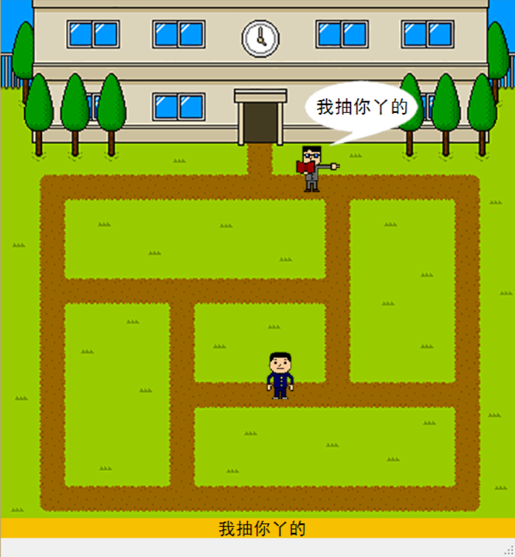
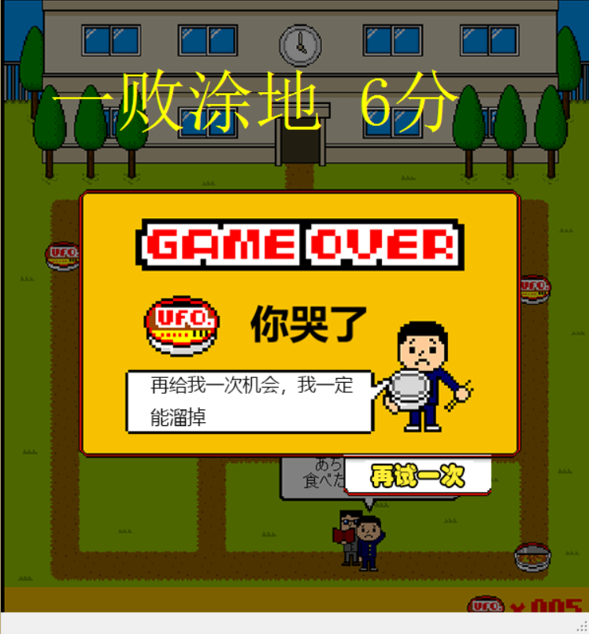

# Have-instant-noodles-in-class C#
Winform上课偷吃方便面小游戏源码。

本游戏使用VS2008制作，游戏背景为玩家因想吃方便面而溜出教室，不料却遭到老师的追捕，玩家需在操场与老师周旋一定时间，等到泡面在地图中刷新，获取到泡面即可获得胜利。

游戏设置了不同的难度，通过普通及困难可以进入下一关。

可以通过点击Have-instant-noodles-in-class\XlonRun\bin\Debug目录下的XlonRun.exe直接试玩。

游戏截图如下：

主界面：

play:

lose：

